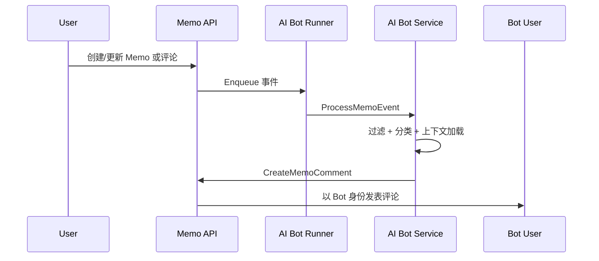

# AI 助手模块设计

## 模块划分

### 1. `internal/aibot`

负责：

1. 配置结构与文件持久化。
2. 内容分类。
3. 上下文拼接。
4. 评论回复生成。
5. 外部待办适配器接口。

### 2. `server/runner/aibot`

负责：

1. 接收 memo 事件。
2. 使用内存队列异步消费。
3. 调用 `internal/aibot.Service` 执行处理。

### 3. `server/router/api/v1/ai_assistant_api.go`

负责：

1. 管理员读取 AI 助手配置。
2. 管理员保存 AI 助手配置。

## 数据流

## 关键设计

### 独立 Bot 用户

使用 `users/{username}` 资源名配置 Bot 用户，评论时通过专用上下文注入该用户 ID，复用现有权限逻辑。

### 触发条件

当前版本采用规则组匹配：

1. 管理员手动配置多组规则。
2. 每组通过已存在标签的多选方式选择标签集合。
3. 每组包含人格提示词、系统提示词。
4. 只要 Memo 标签命中某组任一标签，就使用该组提示词进行分类与回复。
5. 同一标签不能出现在多个组里，避免命中歧义。
6. 不存在默认兜底规则，未命中任何规则组时不会触发。

### 最小侵入

Memo 主链路只新增入队调用：

1. `memo.create`
2. `memo.update`
3. `memo.comment.create`

其余逻辑尽量收束在 `internal/aibot`。
