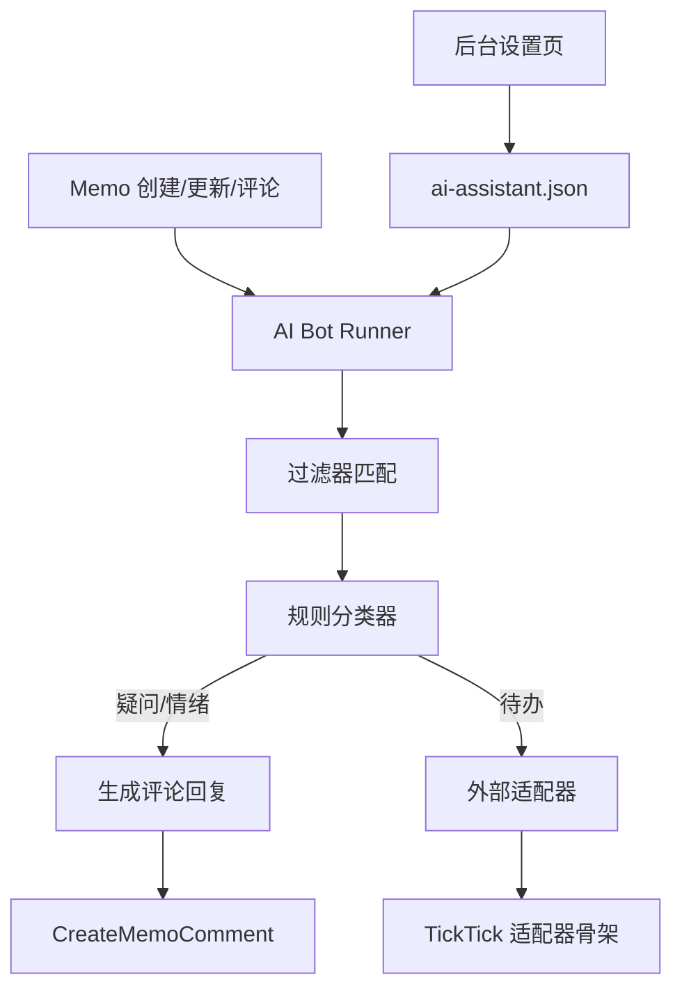

# AI 助手概要设计

## 目标

在 Memos 内部增加一个最小侵入的 AI 助手能力，实现以下目标：

1. 基于规则组列表筛选待处理内容，每组可配置多个标签、人格提示词和系统提示词。
2. 对疑问、情绪、待办三类内容做不同动作。
3. 以独立 Bot 用户身份在评论区持续跟进。
4. 支持后台配置启用状态、Bot 用户、人格提示词、AI Provider 和外部待办适配器。
5. 保持与现有 Memos 主干低耦合，方便后续同步升级。

## 架构

## 当前实现边界

本次实现采用以下折中方案：

1. 不改 proto，避免当前环境下 `buf generate` 与磁盘空间问题阻塞交付。
2. AI 助手配置单独存放在 `data/config/ai-assistant.json`。
3. 后台通过新增 JSON API `/api/v1/ai-assistant` 读写配置。
4. 触发条件使用标签列表，不要求用户编写复杂表达式。
5. Bot 处理通过内存队列异步执行，主写入链路不阻塞。
6. 待办外部适配器先提供接口与 TickTick 骨架，暂未完成真实 API 接入。

## 后续演进建议

1. 当环境具备 `buf` 与足够磁盘空间后，将 AI 助手配置迁移到正式 `InstanceSetting`。
2. 将内存队列升级为持久化任务表，支持重试与审计。
3. 引入真实的 LLM 聊天/分类能力，替换当前规则优先的 MVP 分类器。
